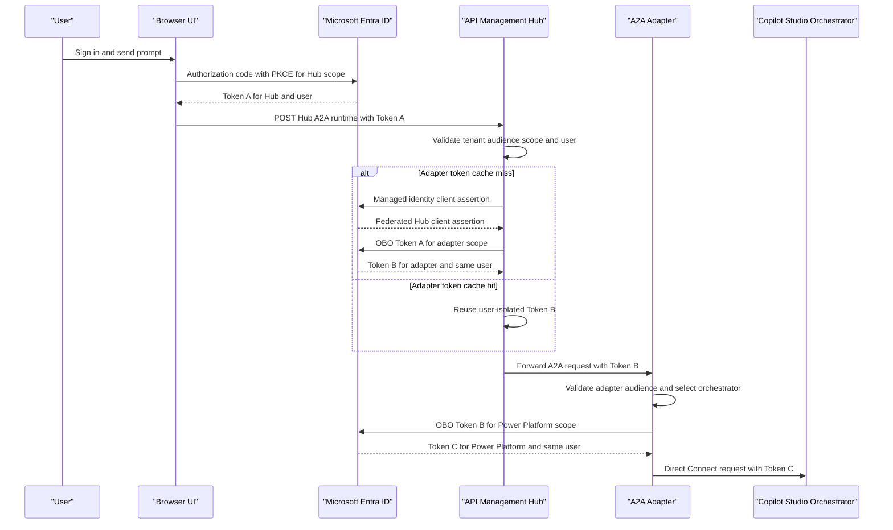
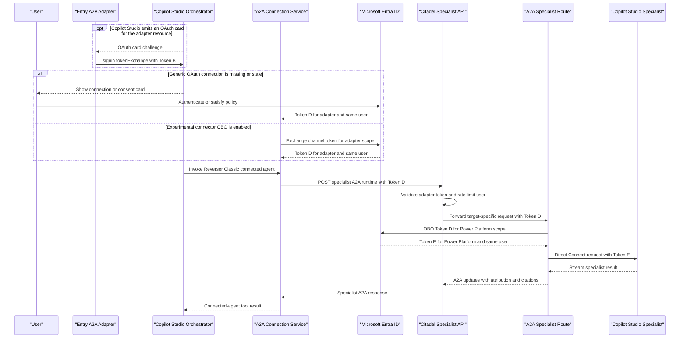
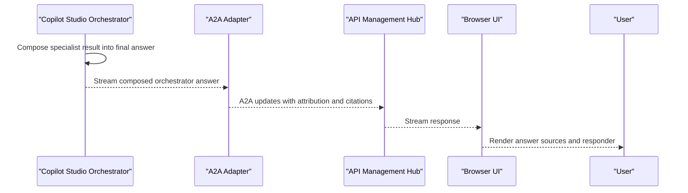

# Authentication and OBO Sequence Diagrams

The solution exposes A2A JSON-RPC endpoints through API Management and a .NET adapter, with synchronous and streamed calls to Copilot Studio. Authentication uses chained Microsoft Entra delegated exchanges so each hop receives a token minted for its own audience.

For intermittent connection prompts or a `404` that produces no APIM or App Service
request, see [Copilot Studio pre-APIM 404 troubleshooting](./copilot-studio-pre-apim-404-troubleshooting.md).

## Service Catalog

| Service | Port | Category | Purpose |
| --- | ---: | --- | --- |
| FoundryCopilotA2A.Web | 5173 locally | API client | React/Vite diagnostic UI that signs users in and sends A2A requests. |
| API Hub / Citadel APIM | HTTPS 443 | API Layer | Validates delegated tokens, rate-limits by user, performs Hub-to-adapter OBO, and exposes public agent cards plus protected runtimes. |
| FoundryCopilotA2A.Adapter | 5099 locally / HTTPS 443 on App Service | Business | Validates adapter tokens, routes A2A requests, performs downstream OBO, invokes Copilot Studio, and streams A2A responses. |
| Copilot Studio Orchestrator | Provider managed | Business | Receives the user request through Direct Connect and decides whether to call a connected specialist agent. |
| Copilot Studio Specialist | Provider managed | Business | Handles a bounded specialist task and returns its result to the orchestrator. |
| Microsoft Entra ID | HTTPS 443 | Infrastructure | Issues SPA, Hub, adapter, connector, and Power Platform tokens and enforces consent and Conditional Access. |
| Log Analytics and Application Insights | Provider managed | Observability | Receives sanitized traces, metrics, and platform diagnostics. |

## API Endpoints Inventory

| Service | Method | Path | Request Type | Response Type |
| --- | --- | --- | --- | --- |
| APIM Hub | GET | `/hub/.well-known/agent-card.json` | None | Public A2A agent card |
| APIM Hub | GET | `/hub/a2a-agents/{agentId}/.well-known/agent-card.json` | Agent ID | Public specialist A2A agent card |
| APIM Hub | POST | `/hub/a2a/copilot-studio` | A2A JSON-RPC message and Hub bearer token | A2A task/message stream |
| APIM Hub | POST | `/hub/a2a-agents/{agentId}/a2a` | A2A JSON-RPC message and Hub bearer token | Specialist A2A task/message stream for callers explicitly configured for the Hub audience |
| Citadel APIM | GET | `/<api-path>/a2a-agents/{agentId}/.well-known/agent-card.json` | Agent ID | Public specialist A2A agent card |
| Citadel APIM | POST | `/<api-path>/a2a-agents/{agentId}/a2a` | A2A JSON-RPC message and adapter bearer token | Native Copilot Studio specialist callback |
| Adapter | GET | `/api/agents` | None | `CopilotAgentCatalog` |
| Adapter | GET | `/api/connectivity` | Adapter bearer token when authentication is enabled | Connectivity diagnostics |
| Adapter | GET | `/api/traces/{traceId}` | Trace ID and adapter bearer token | Sanitized adapter trace |
| Adapter | POST | `/a2a/copilot-studio` | A2A JSON-RPC message and adapter bearer token | A2A task/message stream |
| Adapter | POST | `/a2a-agents/{agentId}/a2a` | A2A JSON-RPC message and adapter bearer token | Target-specific A2A task/message stream |

Public agent-card operations deliberately allow anonymous discovery. Runtime, trace, and connectivity operations require a correctly scoped delegated token when authentication is enabled.

The Hub and Citadel rows are separate logical trust boundaries and may be separate APIM APIs or separate APIM services. The repository's two infrastructure stacks deploy them separately. Do not apply the Hub OBO policy to an adapter-audience Citadel specialist callback.

## Management & Observability Endpoints

| Service | Endpoint | Custom Metrics |
| --- | --- | --- |
| Adapter | `GET /health` | Health status only |
| Adapter | `GET /api/connectivity` | Configuration diagnostics without secrets |
| Adapter | `GET /api/traces/{traceId}` | Sanitized request-owned trace |
| Adapter telemetry | Application Insights | A2A invocation duration, Copilot Studio invocation, token exchange, chain execution, idempotency, and failure outcome metrics |
| APIM | Azure diagnostics | Gateway request, policy, and backend telemetry |

## DTOs & Contracts

- The browser sends an A2A `SendStreamingMessage` JSON-RPC request with a user message, `messageId`, `contextId`, and bounded prior-turn metadata.
- `A2ARequestMetadata` is the adapter's request-scoped contract for the selected entry agent, optional chain target, caller identity, bearer assertion, history, and A2A identifiers.
- `CopilotInvocationUpdate` is the internal streaming contract. It carries answer text or informative progress, provider conversation/response IDs, responder identity, and optional structured citations.
- `CopilotAgentCatalog` and `CopilotAgent` describe available entry agents, supported chain targets, and provider ownership to the browser.
- `OAuthCardInfo` represents a Copilot Studio OAuth challenge. The adapter never returns a downstream token to the UI; it can answer the challenge server-side with `signin/tokenExchange` only when the requested resource matches the inbound token audience.
- Agent cards advertise runtime URLs, protocol capabilities, and OAuth security schemes. They contain metadata, not credentials or access tokens.

The browser and adapter use JSON with A2A 1.0 plus compatibility handling for A2A 0.3. Streaming responses use A2A task and artifact updates rather than a separate message broker.

## Communication Patterns

### Token boundaries

| Token | Issued to | Audience | Used for |
| --- | --- | --- | --- |
| A | Browser SPA | `api://<hub-client-id>` | Calling APIM Hub |
| B | APIM Hub on behalf of the user | `api://<adapter-client-id>` | Calling the adapter |
| C | Adapter on behalf of the user | Power Platform or Copilot Studio scope | Calling the orchestrator through Direct Connect |
| D | Copilot Studio A2A connection for the same user | `api://<adapter-client-id>` | Calling the Citadel specialist APIM route |
| E | Adapter on behalf of the user | Power Platform or Copilot Studio scope | Calling the specialist |

Tokens A through E describe the logical audience transitions. With generic OAuth, the connection may reuse a valid adapter-audience user token supplied through `signin/tokenExchange`; with the experimental connector OBO configuration, the connection service issues a new adapter-audience Token D. In both cases, the specialist callback reaches APIM with the adapter audience. A token is never deliberately forwarded to a component whose audience does not match it.

### Access-token renewal and refresh tokens

Most tokens shown above are short-lived access tokens. Their renewal is owned by the component that acquired them:

| Component | How access continues after expiry | Application action required |
| --- | --- | --- |
| Browser SPA | MSAL silently renews Token A using its browser-managed session and token cache. It redirects the user only when silent renewal is no longer allowed. | Keep using `acquireTokenSilent` with an interactive fallback; never read or store a refresh token in application code. |
| APIM Hub | APIM caches Token B only until shortly before expiry. On the next request it repeats OBO using the current Token A from the browser. | None. APIM does not need a stored user refresh token. |
| Adapter | MSAL caches downstream access-token state. When necessary, the adapter repeats OBO using the current adapter-audience Token B or D supplied with that request. | None. Do not persist user refresh tokens in the adapter or Key Vault. |
| Generic OAuth A2A connection | The connection requests `offline_access`. Power Platform securely stores and rotates the user's refresh token and obtains new Token D access tokens. | Configure `offline_access`, the token/refresh endpoint, and the connector client credential correctly. Do not handle the user's refresh token yourself. |
| Experimental connector OBO | Power Platform silently exchanges the authenticated user's current channel token for Token D. The platform owns any connection/token state. | Maintain the connector OBO configuration and consent; do not assume or depend on direct refresh-token access. |

An expired access token should normally be invisible to the user. A prompt is required only when silent renewal fails—for example after revocation, long inactivity, connector-client secret expiry, a Conditional Access sign-in-frequency or MFA challenge, account disablement, scope changes, or connection replacement.

The connector consent-card bypass changes only whether Copilot Studio shows its confirmation card. It does not refresh tokens, repair stale connections, suppress Entra interaction when policy requires it, or replace the `offline_access` scope.

### Browser to Hub

The SPA uses MSAL authorization code with PKCE and session storage. It requests `api://<hub-client-id>/access_as_user` when the Hub is the selected gateway. Silent acquisition is attempted first; interaction is used only when Entra requires it.

APIM validates Token A's tenant, Hub audience, `access_as_user` scope, issuer, and lifetime. Its rate-limit key includes tenant and user object IDs. The Hub then authenticates its own confidential-client identity with APIM managed identity plus a federated credential, and redeems Token A through Entra OBO for Token B. The adapter token cache is isolated by tenant, user, and requested scope and expires before the token.

### Hub to adapter to Copilot Studio

APIM replaces the inbound `Authorization` header with Token B. The adapter repeats issuer, audience, and lifetime validation and requires a delegated user assertion for the standard path.

`OboTokenBroker` is a singleton MSAL confidential client. It authenticates with either the configured client secret or a managed-identity client assertion. It refuses to exchange a token issued for the wrong adapter audience, then obtains Token C for the selected Copilot Studio resource. The Copilot Studio SDK invokes the configured Direct Connect URL with Token C.

### Native orchestrator to specialist callback

The UI's chain target is only an instruction to the native orchestrator; it is not proof that the specialist ran. The adapter asks the orchestrator to call the named A2A connected agent. Copilot Studio routing uses the connected agent's name, description, and agent card to decide when to invoke it.

The repository's validated native chain does not return through the Hub-audience policy. The connected-agent connection obtains or receives Token D for the **adapter** audience as the same user, then calls the Citadel specialist route through APIM. Citadel validates the adapter audience and delegated scope and forwards Token D unchanged. The target-specific adapter route selects the specialist and performs adapter-to-Power-Platform OBO to create Token E. Only entry into that route is recorded as actual specialist tool execution.

The Hub API also exposes a specialist route for callers explicitly configured to request the Hub scope. That variant performs another Hub-to-adapter OBO exchange, but it is distinct from the adapter-audience native connection validated in [Copilot Studio A2A connection lifecycle and consent](./copilot-studio-a2a-connections.md).

### Response composition

The specialist streams progress and answer data to its adapter route. The adapter adds immediate-responder attribution and preserves structured citations. APIM forwards the stream to the Copilot Studio orchestrator, which composes its final answer. That answer streams back through Direct Connect, the entry adapter call, APIM, and the browser. The final UI answer is attributed to the orchestrator; a specialist callback has its own trace and responder attribution.

### Connector and authentication cards

Three card-like concepts must not be conflated:

1. **A2A agent card**: machine-readable discovery metadata at `.well-known/agent-card.json`. It advertises the runtime URL, skills/capabilities, and OAuth security scheme. It does not appear as an interactive consent prompt.
2. **Connection or consent card**: interactive Copilot Studio UI shown when a user has no usable connection, a connection is stale/expired, consent is missing, or Conditional Access requires interaction. With generic OAuth, each user normally connects once per A2A target and Power Platform environment.
3. **OAuth card challenge**: a provider activity emitted during an agent turn when a connector needs a token. The adapter can answer it with `signin/tokenExchange` using the caller's token only when the requested exchange resource matches that token's audience. Otherwise it fails instead of leaking a token to the wrong resource.

The connector consent-card bypass suppresses conversational connector confirmation cards for one standard-harness agent and all its users. It does not grant Entra consent, create user connections, bypass MFA or Conditional Access, disable token validation, or convert delegated calls into application calls. Apply it to the orchestrator because the orchestrator owns the specialist connection. It does not apply to GitHub Copilot-harness agents.

For native A2A connected agents, generic OAuth 2.0 is the supported configuration. Converting the generated Dataverse custom connector to Microsoft Entra on-behalf-of login can make the specialist connection silent for users, but this repository documents it as experimental and potentially reverted by later Copilot Studio edits.

### Resilience and error behavior

- APIM returns `401` for missing, invalid, wrong-tenant, wrong-audience, or wrong-scope tokens.
- The Hub API returns `403` when its Hub-to-adapter OBO request fails due to consent or Conditional Access; it exposes only a bounded Entra error code and never echoes token endpoint responses.
- The Citadel specialist policy does not perform Hub OBO; it validates and forwards the adapter-audience delegated token.
- The adapter rejects wrong-audience assertions before OBO.
- The Copilot Studio orchestrator client and outbound A2A chain clients do not retry whole turns because a retry could execute the specialist twice. The ordinary specialist SDK client retains the repository's standard outbound HTTP resilience handler.
- Copilot Studio request timeout defaults to 60 seconds; Foundry/A2A chain calls default to 120 seconds.
- Conversation state is isolated by user, agent, and A2A context and has a 30-minute sliding expiry.
- There is no asynchronous queue. A2A streaming uses synchronous HTTP/SSE-style response updates.

## Service Technology Matrix

| Service | Web | Discovery | Gateway | Cache | Metrics |
| --- | --- | --- | --- | --- | --- |
| Browser UI | React/Vite and MSAL | Agent catalog and cards | Calls APIM Hub | MSAL session cache | Client timeline |
| APIM Hub | APIM policies | Public A2A cards | JWT validation, OBO, rate limiting | Per-user token cache | Azure diagnostics |
| Citadel APIM | APIM policies | Public specialist cards | Adapter-token validation and rate limiting | None | Azure diagnostics |
| Adapter | ASP.NET Core and A2A hosting | Agent catalog and APIM discovery | No | MSAL, conversation, and idempotency caches | OpenTelemetry and Application Insights |
| Copilot Studio | Managed agent runtime | Connected-agent card metadata | Native orchestration | Managed user connections | Provider telemetry |

## Service Communication Sequence

### 1. Frontend to Copilot Studio orchestrator

<!-- mermaid-checked: every participant uses `participant Id as "Label"`, no \n in aliases/messages/notes, every alt/opt/loop closed by end, no `:` inside any alias -->

### 2. Orchestrator to specialist

<!-- mermaid-checked: every participant uses `participant Id as "Label"`, no \n in aliases/messages/notes, every alt/opt/loop closed by end, no `:` inside any alias -->

### 3. Composed response back to the UI

<!-- mermaid-checked: every participant uses `participant Id as "Label"`, no \n in aliases/messages/notes, every alt/opt/loop closed by end, no `:` inside any alias -->

